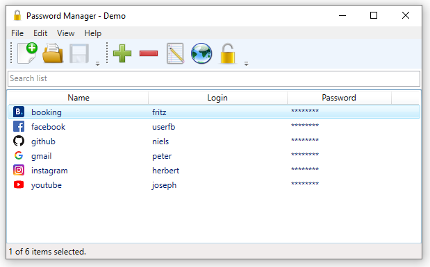
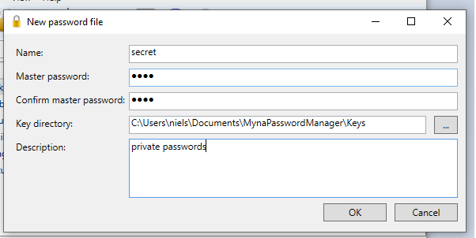
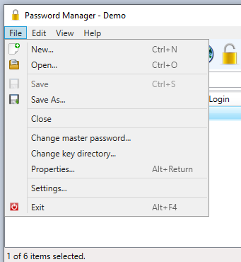
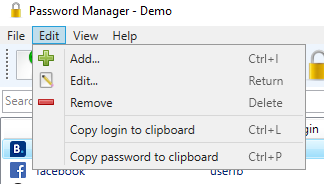
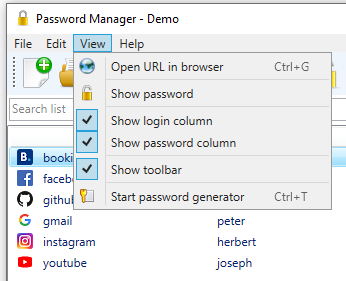
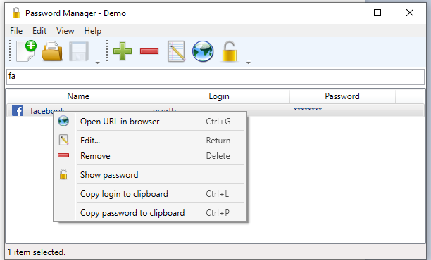
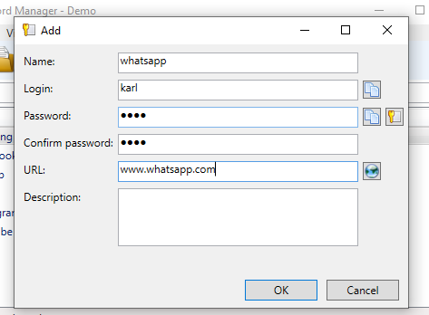
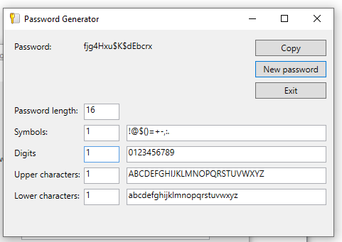
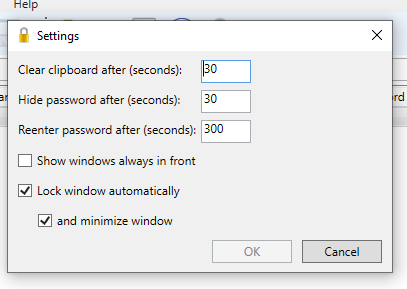

# Myna Password Manager

A password manager for Windows using WPF.

# Installation

The latest MSI file can be found here: https://github.com/nylssoft/MynaPasswordManager/releases/download/V1.0.4/MynaPasswordManager.msi.

The program requires .NET framework v4.5.2.

## Encryption

The passwords for each item are encrypted with the Rijndael algorithm using an encrypted key file.
Preferable the key file should be stored on a different device than the password file.
The key file is encrypted using the SHA-256 hash of the master password.
The process itself tries to keep the plain text passwords in memory as short as possible. The SecureString class is used to store passwords in memory for the life time of the process.

## Features

* Random password generator
* Copy login and password to clipboard and clear clipboard after 30 seconds
* Open website for login
* Shortcuts for most commands
* Thumbnails for login websites
* Secure password storage in memory and in encrypted files
* Change of master password and key file
* Available for German and English

## Screenshots

### Create New Repository

### Menu Items

#### File Menu Item

#### Edit Menu Item

#### View Menu Item

#### Context Menu Item and Search Filter

### Add Password Entry

### Password Generator

### Settings

## Build

- Build with VS 2017
- WiX ToolSet is required to build a MSI, see https://http://wixtoolset.org/

## Licenses

The following icons are used from the **Open Icon Library** (https://sourceforge.net/projects/openiconlibrary):

application-exit-5.png / nuovext2 / LGPL-2.1 
document-decrypt-3.png / oxygen / CC-BY-SA 3.0 or LGPL 
document-encrypt-3.png / oxygen / CC-BY-SA 3.0 or LGPL 
document-new-6.ico / oxygen / CC-BY-SA 3.0 or LGPL 
document-open-2.png / echo / CC-BY-SA-3.0 
document-properties-2.png / gnome / GPLv2 
document-save-7.png / nuovext2 / LGPL-2.1 
document-save-as-6.png / nuovext2 / LGPL-2.1 
edit.png / gimp / GPLv2 
edit-copy-7.png / famfamfam-silk / CC-BY-2.5 or CC-BY-3.0 
homepage.png / nuvola / LGPL-2.1 
key.png / famfamfam-silk / CC-BY-2.5 or CC-BY-3.0 
kgpg_info.png / nuvola / LGPL-2.1 
list-add-4.ico / oxygen / CC-BY-SA 3.0 or LGPL 
list-remove-4.ico / oxygen / CC-BY-SA 3.0 or LGPL

